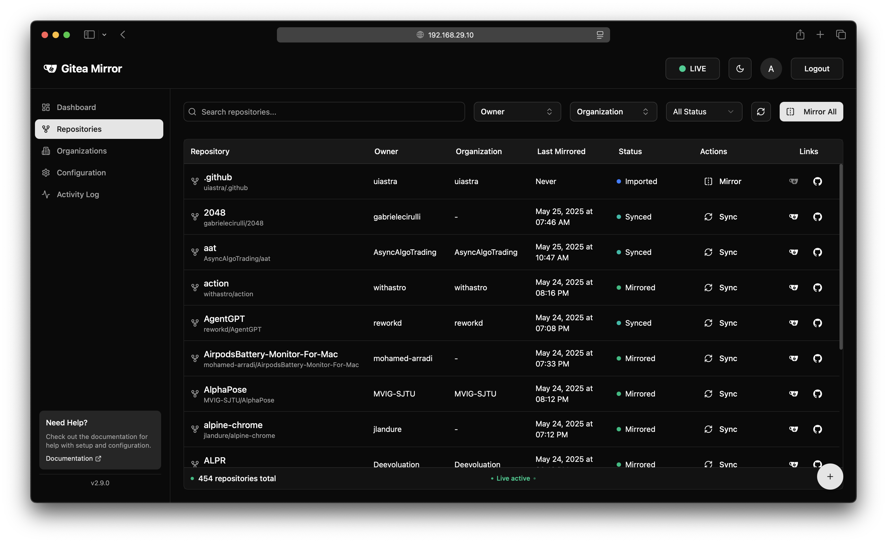
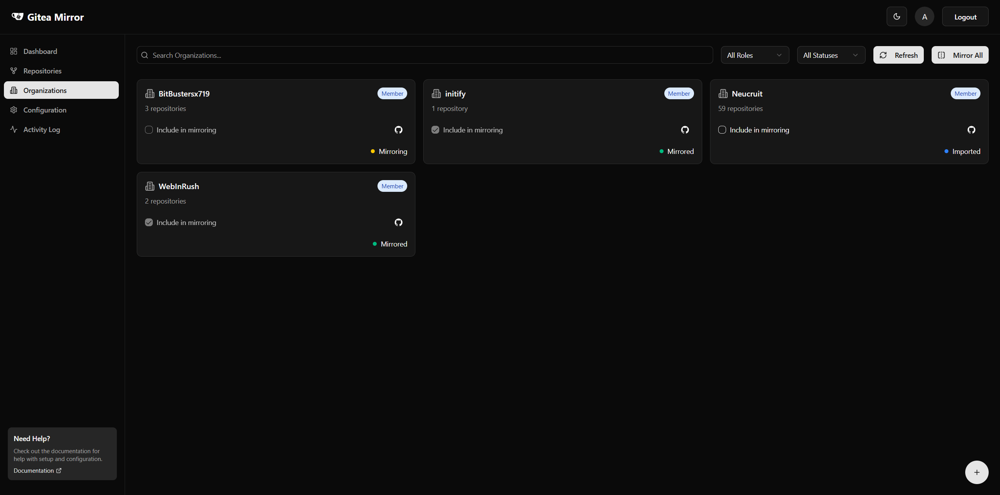
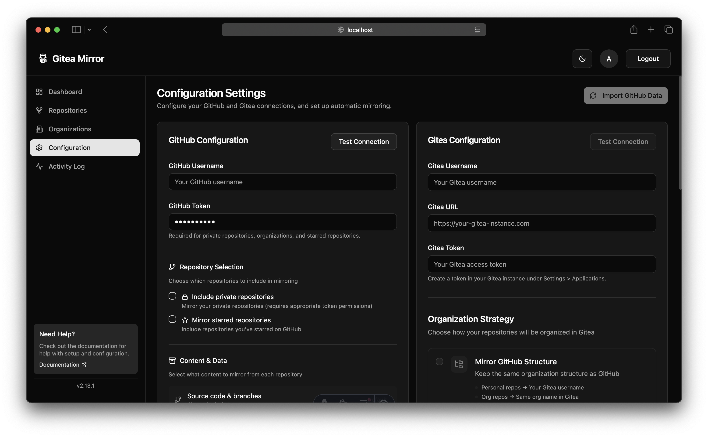
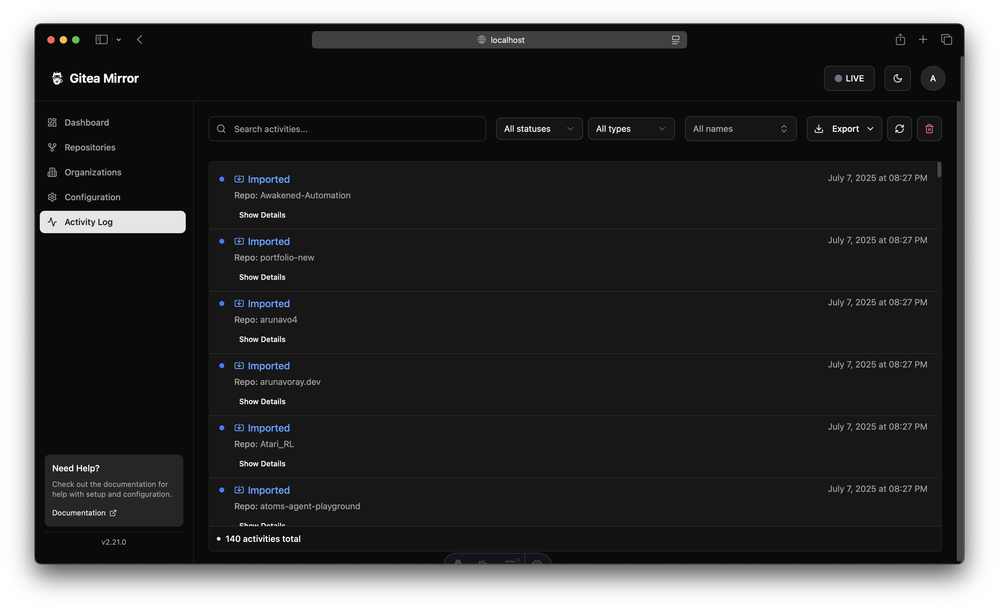

<!-- Badges -->
<p align="center">
  <a href="https://github.com/arunavo4/gitea-mirror/releases/latest"></a>
  <a href="https://github.com/arunavo4/gitea-mirror/actions/workflows/astro-build-test.yml"></a>
  <a href="https://github.com/arunavo4/gitea-mirror/pkgs/container/gitea-mirror"></a>
  <a href="https://github.com/arunavo4/gitea-mirror/blob/main/LICENSE"></a>
</p>

# Gitea Mirror

<p align="center">
  <i>A modern web application for automatically mirroring repositories from GitHub to your self-hosted Gitea instance.</i><br>
  <sub>Designed for developers, teams, and organizations who want to retain full control of their code while still collaborating on GitHub.</sub>
</p>

## 🚀 Quick Start

```bash
docker compose --profile production up -d
# or
pnpm setup && pnpm dev
```

<p align="center">
  
</p>

## ✨ Features

- 🔁 Sync public, private, or starred GitHub repos to Gitea
- 🏢 Mirror entire organizations with structure preservation
- 🐞 Optional mirroring of issues and labels
- 🌟 Mirror your starred repositories
- 🕹️ Modern user interface with toast notifications and smooth experience
- 🧠 Smart filtering and job queue with detailed logs
- 🛠️ Works with personal access tokens (GitHub + Gitea)
- 🔒 First-time user signup experience with secure authentication
- 🐳 Fully Dockerized + can be self-hosted in minutes
- 📊 Dashboard with real-time status updates
- ⏱️ Scheduled automatic mirroring

## 📸 Screenshots

<p align="center">
  
  
</p>
<p align="center">
  
  
</p>

### Dashboard
The dashboard provides an overview of your mirroring status, including total repositories, successfully mirrored repositories, and recent activity.

### Repository Management
Manage all your repositories in one place. Filter by status, search by name, and trigger manual mirroring operations.

### Configuration
Easily configure your GitHub and Gitea connections, set up automatic mirroring schedules, and manage organization mirroring.

## Getting Started

See the [Quick Start Guide](docs/quickstart.md) for detailed instructions on getting up and running quickly.

-### Prerequisites

- Bun 1.2.9 or later
- A GitHub account with a personal access token
- A Gitea instance with an access token


#### Database

The database (`data/gitea-mirror.db`) is created when the application first runs. It starts empty and is populated as you configure and use the application.


> [!NOTE]
> On first launch, you'll be guided through creating an admin account with your chosen credentials.

#### Production Database

The production database (`data/gitea-mirror.db`) is created when the application runs in production mode. It starts empty and is populated as you configure and use the application.


> [!IMPORTANT]
> The production database file is excluded from the Git repository as it may contain sensitive information like GitHub and Gitea tokens. **Never commit this file to the repository.**

##### Database Initialization

Before running the application in production mode for the first time, you need to initialize the database:

```bash
# Initialize the database for production mode
pnpm setup
```

This will create the necessary tables. On first launch, you'll be guided through creating your admin account with a secure password.

### Installation

#### Using Docker (Recommended)

Gitea Mirror provides multi-architecture Docker images that work on both ARM64 (e.g., Apple Silicon, Raspberry Pi) and x86_64 (Intel/AMD) platforms.

##### Using Docker Compose (Recommended)

```bash
# Start the application using Docker Compose
docker compose --profile production up -d

# For development mode (requires configuration)
# Ensure you have run pnpm setup first
docker compose -f docker-compose.dev.yml up -d
```


> [!IMPORTANT]
> **Docker Compose is the recommended method for running Gitea Mirror** as it automatically sets up the required Redis sidecar service that the application depends on.


> [!NOTE]
> The examples above use the modern `docker compose` syntax (without hyphen) which is the recommended approach for Docker Compose V2. If you're using an older version of Docker Compose (V1), you may need to use `docker-compose` (with hyphen) instead.

##### Using Pre-built Images from GitHub Container Registry

If you want to run the container directly without Docker Compose, you'll need to set up a Redis instance separately:

```bash
# First, start a Redis container
docker run -d --name gitea-mirror-redis redis:alpine

# Pull the latest multi-architecture image
docker pull ghcr.io/arunavo4/gitea-mirror:latest

# Run the application with a link to the Redis container
# Note: The REDIS_URL environment variable is required and must point to the Redis container
docker run -d -p 4321:4321 --link gitea-mirror-redis:redis \
  -e REDIS_URL=redis://redis:6379 \
  ghcr.io/arunavo4/gitea-mirror:latest
```

##### Building Docker Images Manually

The project includes a build script to create and manage multi-architecture Docker images:

```bash
# Copy example environment file if you don't have one
cp .env.example .env

# Edit .env file with your preferred settings
# DOCKER_REGISTRY, DOCKER_IMAGE, DOCKER_TAG, etc.

# Build and load into local Docker
./scripts/build-docker.sh --load

# OR: Build and push to a registry (requires authentication)
./scripts/build-docker.sh --push

# Then run with Docker Compose
docker compose --profile production up -d
```

See [Docker build documentation](./scripts/README-docker.md) for more details.

##### Building Your Own Image

For manual Docker builds (without the helper script):

```bash
# Build the Docker image for your current architecture
docker build -t gitea-mirror:latest .

# Build multi-architecture images (requires Docker Buildx)
docker buildx create --name multiarch --driver docker-container --use
docker buildx build --platform linux/amd64,linux/arm64 -t gitea-mirror:latest --load .

# If you encounter issues with Buildx, you can try these workarounds:
# 1. Retry with network settings
docker buildx build --platform linux/amd64,linux/arm64 -t gitea-mirror:latest --network=host --load .

# 2. Build one platform at a time if you're having resource issues
docker buildx build --platform linux/amd64 -t gitea-mirror:amd64 --load .
docker buildx build --platform linux/arm64 -t gitea-mirror:arm64 --load .

# Create a named volume for database persistence
docker volume create gitea-mirror-data
```

##### Environment Variables

The Docker container can be configured with the following environment variables:

- `DATABASE_URL`: SQLite database URL (default: `file:data/gitea-mirror.db`)
- `HOST`: Host to bind to (default: `0.0.0.0`)
- `PORT`: Port to listen on (default: `4321`)
- `JWT_SECRET`: Secret key for JWT token generation (important for security)
- `REDIS_URL`: URL for Redis connection (required, default: none). When using Docker Compose, this should be set to `redis://redis:6379` to connect to the Redis container.


#### Manual Installation

```bash
# Clone the repository
git clone https://github.com/arunavo4/gitea-mirror.git
cd gitea-mirror

# Quick setup (installs dependencies and initializes the database)
pnpm setup

# Development Mode Options

# Run in development mode
pnpm dev

# Run in development mode with clean database (removes existing DB first)
pnpm dev:clean

# Production Mode Options

# Build the application
pnpm build

# Preview the production build
pnpm preview

# Start the production server (default)
pnpm start

# Start the production server with a clean setup
pnpm start:fresh

# Database Management

# Initialize the database
pnpm init-db

# Reset users for testing first-time signup
pnpm reset-users

# Check database status
pnpm check-db
```

### Configuration

Gitea Mirror can be configured through environment variables or through the web UI. See the [Configuration Guide](docs/configuration.md) for more details.

Key configuration options include:

- GitHub connection settings (username, token, repository filters)
- Gitea connection settings (URL, token, organization)
- Mirroring options (issues, starred repositories, organizations)
- Scheduling options for automatic mirroring

> [!IMPORTANT]
> **Redis is a required component for Gitea Mirror** as it's used for job queuing and caching.

## 🚀 Development

### Local Development Setup

```bash
# Install dependencies
pnpm setup

# Start the development server
pnpm dev
```


### Setting Up a Local Gitea Instance for Testing

For full end-to-end testing, you can set up a local Gitea instance using Docker:

```bash
# Create a Docker network for Gitea and Gitea Mirror to communicate
# Using the --label flag ensures proper Docker Compose compatibility
docker network create --label com.docker.compose.network=gitea-network gitea-network

# Create volumes for Gitea data persistence
docker volume create gitea-data
docker volume create gitea-config

# Run Gitea container
docker run -d \
  --name gitea \
  --network gitea-network \
  -p 3001:3000 \
  -p 2222:22 \
  -v gitea-data:/data \
  -v gitea-config:/etc/gitea \
  -e USER_UID=1000 \
  -e USER_GID=1000 \
  -e GITEA__database__DB_TYPE=sqlite3 \
  -e GITEA__database__PATH=/data/gitea.db \
  -e GITEA__server__DOMAIN=localhost \
  -e GITEA__server__ROOT_URL=http://localhost:3001/ \
  -e GITEA__server__SSH_DOMAIN=localhost \
  -e GITEA__server__SSH_PORT=2222 \
  -e GITEA__server__START_SSH_SERVER=true \
  -e GITEA__security__INSTALL_LOCK=true \
  -e GITEA__service__DISABLE_REGISTRATION=false \
  gitea/gitea:latest
```


> [!TIP]
> After Gitea is running:
> 1. Access Gitea at http://localhost:3001/
> 2. Register a new user
> 3. Create a personal access token in Gitea (Settings > Applications > Generate New Token)
> 4. Run Gitea Mirror with the local Gitea configuration:

```bash
# Run Gitea Mirror connected to the local Gitea instance
docker run -d \
  --name gitea-mirror-dev \
  --network gitea-network \
  -p 4321:4321 \
  -v gitea-mirror-data:/app/data \
  -e NODE_ENV=development \
  -e JWT_SECRET=dev-secret-key \
  -e GITHUB_TOKEN=your-github-token \
  -e GITHUB_USERNAME=your-github-username \
  -e GITEA_URL=http://gitea:3000 \
  -e GITEA_TOKEN=your-local-gitea-token \
  -e GITEA_USERNAME=your-local-gitea-username \
  arunavo4/gitea-mirror:latest
```

> [!NOTE]
> This setup allows you to test the full mirroring functionality with a local Gitea instance.

### Using Docker Compose for Development


For convenience, a dedicated development docker-compose file is provided that sets up both Gitea Mirror and a local Gitea instance:

```bash
# Start with development environment and local Gitea instance
docker compose -f docker-compose.dev.yml up -d
```


> [!TIP]
> You can also create a `.env` file with your GitHub and Gitea credentials:
>
> ```env
> # GitHub credentials
> GITHUB_TOKEN=your-github-token
> GITHUB_USERNAME=your-github-username
>
> # Gitea credentials (will be set up after you create a user in the local Gitea instance)
> GITEA_TOKEN=your-local-gitea-token
> GITEA_USERNAME=your-local-gitea-username
> ```

## Technologies Used

- **Frontend**: Astro, React, Shadcn UI, Tailwind CSS v4
 - **Backend**: Bun
- **Database**: SQLite (default) or PostgreSQL
- **Caching/Queue**: Redis
- **API Integration**: GitHub API (Octokit), Gitea API

## Contributing

Contributions are welcome! Please feel free to submit a Pull Request.

## License

This project is licensed under the MIT License - see the [LICENSE](LICENSE) file for details.

## Project Status

This project is now complete and ready for production use with version 1.0.0. All planned features have been implemented, thoroughly tested, and optimized for performance:

- ✅ User-friendly dashboard with status overview
- ✅ Repository management interface
- ✅ Organization management interface
- ✅ Configuration management for GitHub and Gitea
- ✅ Scheduling and automation
- ✅ Activity logging and monitoring
- ✅ Responsive design for all screen sizes
- ✅ Modern toast notifications for better user feedback
- ✅ First-time user signup experience
- ✅ Better error handling and user guidance
- ✅ Comprehensive error handling
- ✅ Unit tests for components and API
- ✅ Direct GitHub to Gitea mirroring (no external dependencies)
- ✅ Docker and docker-compose support for easy deployment
- ✅ Multi-architecture support (ARM64 and x86_64)
- ✅ Light/dark mode toggle
- ✅ Persistent configuration storage

## Troubleshooting

### Docker Compose Network Issues

> [!WARNING]
> If you encounter network-related warnings or errors when running Docker Compose, such as:
>
> ```
> WARN[0095] a network with name gitea-network exists but was not created by compose.
> Set `external: true` to use an existing network
> ```
>
> or
>
> ```
> network gitea-network was found but has incorrect label com.docker.compose.network set to "" (expected: "gitea-network")
> ```

Try the following steps:

1. Stop the current Docker Compose stack:
   ```bash
   docker compose -f docker-compose.dev.yml down
   ```

2. Remove the existing network:
   ```bash
   docker network rm gitea-network
   ```

3. Restart the Docker Compose stack:
   ```bash
   docker compose -f docker-compose.dev.yml up -d
   ```

> [!TIP]
> If you need to share the network with other Docker Compose projects, you can modify the `docker-compose.dev.yml` file to mark the network as external:
>
> ```yaml
> networks:
>   gitea-network:
>     name: gitea-network
>     external: true
> ```

### Redis Connection Issues

> [!CAUTION]
> If the application fails to connect to Redis with errors like `ECONNREFUSED 127.0.0.1:6379`, ensure:
>
> 1. The Redis container is running:
>    ```bash
>    docker ps | grep redis
>    ```
> 2. The `REDIS_URL` environment variable is correctly set to `redis://redis:6379` in your Docker Compose file.
> 3. Both the application and Redis containers are on the same Docker network.
> 4. If running without Docker Compose, ensure you've started a Redis container and linked it properly:
>    ```bash
>    # Start Redis container
>    docker run -d --name gitea-mirror-redis redis:alpine
>    # Run application with link to Redis
>    docker run -d -p 4321:4321 --link gitea-mirror-redis:redis \
>      -e REDIS_URL=redis://redis:6379 \
>      ghcr.io/arunavo4/gitea-mirror:latest
>    ```


#### Improving Redis Connection Resilience

> [!TIP]
> For better Redis connection handling, you can modify the `src/lib/redis.ts` file to include retry logic and better error handling:

```typescript
import Redis from "ioredis";

// Connect to Redis using REDIS_URL environment variable or default to redis://redis:6379
const redisUrl = process.env.REDIS_URL ?? 'redis://redis:6379';

console.log(`Connecting to Redis at: ${redisUrl}`);

// Configure Redis client with connection options
const redisOptions = {
  retryStrategy: (times) => {
    // Retry with exponential backoff up to 30 seconds
    const delay = Math.min(times * 100, 3000);
    console.log(`Redis connection attempt ${times} failed. Retrying in ${delay}ms...`);
    return delay;
  },
  maxRetriesPerRequest: 5,
  enableReadyCheck: true,
  connectTimeout: 10000,
};

export const redis = new Redis(redisUrl, redisOptions);
export const redisPublisher = new Redis(redisUrl, redisOptions);
export const redisSubscriber = new Redis(redisUrl, redisOptions);

// Log connection events
redis.on('connect', () => console.log('Redis client connected'));
redis.on('error', (err) => console.error('Redis client error:', err));
```


> [!NOTE]
> This implementation provides:
> - Automatic retry with exponential backoff
> - Better error logging
> - Connection event handling
> - Proper timeout settings


### Container Health Checks

> [!TIP]
> If containers are not starting properly, check their health status:
>
> ```bash
> docker ps --format "{{.Names}}: {{.Status}}"
> ```
>
> For more detailed logs:
>
> ```bash
> docker logs gitea-mirror-dev
> ```

## Acknowledgements

- [Octokit](https://github.com/octokit/rest.js/) - GitHub REST API client for JavaScript
- [Shadcn UI](https://ui.shadcn.com/) - For the beautiful UI components
- [Astro](https://astro.build/) - For the excellent web framework
