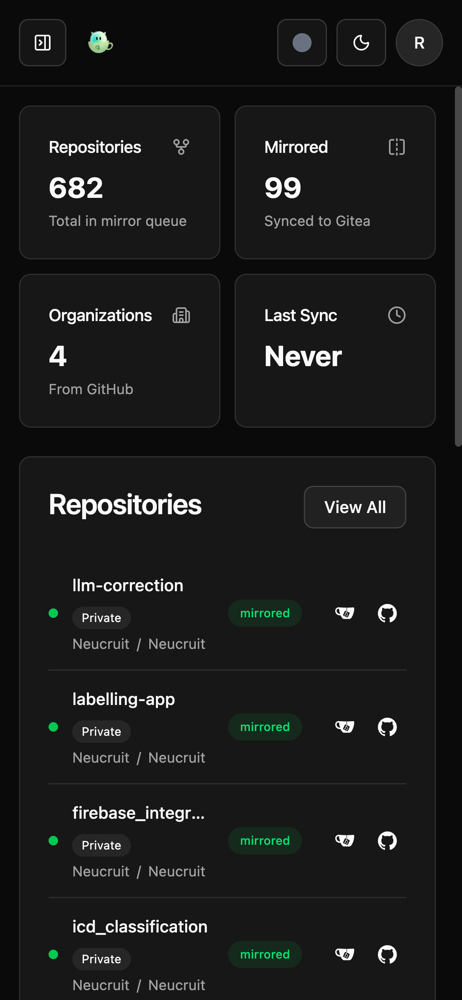
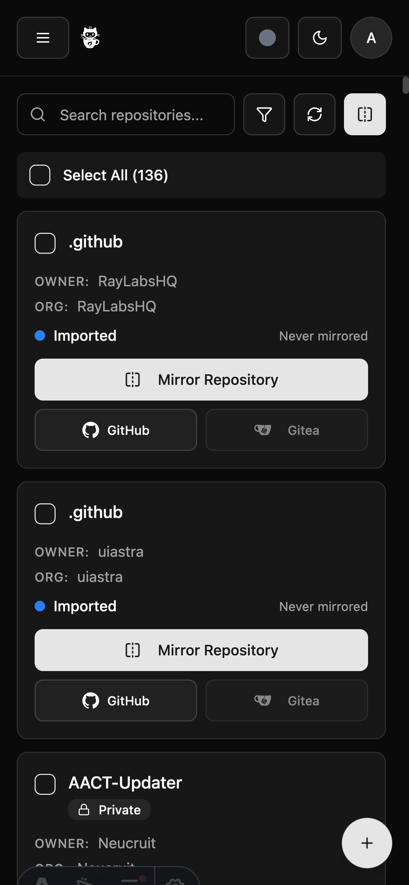
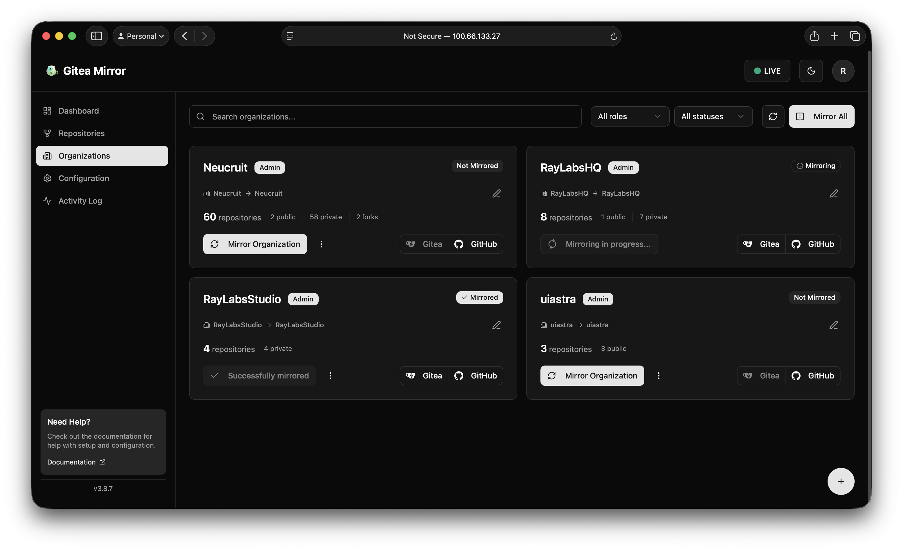
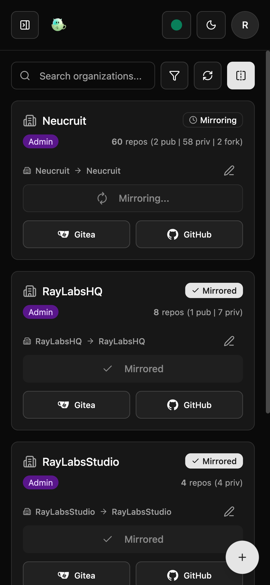

<p align="center">
  
  <h1>Gitea Mirror</h1>
  <p><i>Automatically mirror repositories from GitHub to your self-hosted Gitea instance.</i></p>
  <p align="center">
    <a href="https://github.com/RayLabsHQ/gitea-mirror/releases/latest"></a>
    <a href="https://github.com/RayLabsHQ/gitea-mirror/actions/workflows/astro-build-test.yml"></a>
    <a href="https://github.com/RayLabsHQ/gitea-mirror/pkgs/container/gitea-mirror"></a>
    <a href="https://github.com/RayLabsHQ/gitea-mirror/blob/main/LICENSE"></a>
  </p>
</p>

## 🚀 Quick Start

```bash
# Fastest way - using the simplified Docker setup
docker compose -f docker-compose.alt.yml up -d

# Access at http://localhost:4321
```

First user signup becomes admin. Configure GitHub and Gitea through the web interface!

<p align="center">
  
  
</p>

## ✨ Features

- 🔁 Mirror public, private, and starred GitHub repos to Gitea
- 🏢 Mirror entire organizations with flexible strategies
- 🎯 Custom destination control for repos and organizations
- 📦 **Git LFS support** - Mirror large files with Git LFS
- 📝 **Metadata mirroring** - Issues, pull requests (as issues), labels, milestones, wiki
- 🚫 **Repository ignore** - Mark specific repos to skip
- 🔐 Secure authentication with Better Auth (email/password, SSO, OIDC)
- 📊 Real-time dashboard with activity logs
- ⏱️ Scheduled automatic mirroring with configurable intervals
- 🔄 **Auto-discovery** - Automatically import new GitHub repositories (v3.4.0+)
- 🧹 **Repository cleanup** - Auto-remove repos deleted from GitHub (v3.4.0+)
- 🎯 **Proper mirror intervals** - Respects configured sync intervals (v3.4.0+)
- 🗑️ Automatic database cleanup with configurable retention
- 🐳 Dockerized with multi-arch support (AMD64/ARM64)

## 📸 Screenshots

<div align="center">
  
  
</div>

<div align="center">
  
  
</div>

## Installation

### Docker (Recommended)

We provide two Docker Compose options:

#### Option 1: Quick Start (docker-compose.alt.yml)
Perfect for trying out Gitea Mirror or simple deployments:

```bash
# Clone repository
git clone https://github.com/RayLabsHQ/gitea-mirror.git
cd gitea-mirror

# Start with simplified setup
docker compose -f docker-compose.alt.yml up -d

# Access at http://localhost:4321
```

**Features:**
- ✅ Pre-built image - no building required
- ✅ Minimal configuration needed
- ✅ Data stored in `./data` directory
- ✅ Configure everything through web UI
- ✅ Automatic user/group ID mapping

**Best for:**
- First-time users
- Testing and evaluation
- Simple deployments
- When you prefer web-based configuration

#### Option 2: Full Setup (docker-compose.yml)
For production deployments with environment-based configuration:

```bash
# Start with full configuration options
docker compose up -d
```

**Features:**
- ✅ Build from source or use pre-built image
- ✅ Complete environment variable configuration
- ✅ Support for custom CA certificates
- ✅ Advanced mirror settings (forks, wiki, issues)
- ✅ Multi-registry support

**Best for:**
- Production deployments
- Automated/scripted setups
- Advanced mirror configurations
- When using self-signed certificates

#### Using Pre-built Image Directly

```bash
docker pull ghcr.io/raylabshq/gitea-mirror:latest
```

### Configuration Options

#### Quick Start Configuration (docker-compose.alt.yml)

Minimal `.env` file (optional - has sensible defaults):

```bash
# Custom port (default: 4321)
PORT=4321

# User/Group IDs for file permissions (default: 1000)
PUID=1000
PGID=1000

# Session secret (auto-generated if not set)
BETTER_AUTH_SECRET=your-secret-key-change-this-in-production
```

All other settings are configured through the web interface after starting.

#### Full Setup Configuration (docker-compose.yml)

Supports extensive environment variables for automated deployment. See the full [docker-compose.yml](docker-compose.yml) for all available options including GitHub tokens, Gitea URLs, mirror settings, and more.

📚 **For a complete list of all supported environment variables, see the [Environment Variables Documentation](docs/ENVIRONMENT_VARIABLES.md).**

### LXC Container (Proxmox)

```bash
# One-line install on Proxmox VE
bash -c "$(curl -fsSL https://raw.githubusercontent.com/community-scripts/ProxmoxVE/main/ct/gitea-mirror.sh)"
```

See the [Proxmox VE Community Scripts](https://community-scripts.github.io/ProxmoxVE/scripts?id=gitea-mirror) for more details.

### Nix/NixOS

Zero-configuration deployment with Nix:

```bash
# Run immediately - no setup needed!
nix run --extra-experimental-features 'nix-command flakes' github:RayLabsHQ/gitea-mirror

# Or build and run locally
nix build --extra-experimental-features 'nix-command flakes'
./result/bin/gitea-mirror

# Or install to profile
nix profile install --extra-experimental-features 'nix-command flakes' github:RayLabsHQ/gitea-mirror
gitea-mirror
```

**NixOS users** - add to your configuration:
```nix
{
  inputs.gitea-mirror.url = "github:RayLabsHQ/gitea-mirror";

  services.gitea-mirror = {
    enable = true;
    betterAuthUrl = "https://mirror.example.com";
    openFirewall = true;
  };
}
```

Secrets auto-generate, database auto-initializes. See [NIX.md](NIX.md) for quick reference or [docs/NIX_DEPLOYMENT.md](docs/NIX_DEPLOYMENT.md) for full documentation.

### Manual Installation

```bash
# Install Bun
curl -fsSL https://bun.sh/install | bash

# Setup and run
bun run setup
bun run dev
```

## Usage

1. **First Time Setup**
   - Navigate to http://localhost:4321
   - Create admin account (first user signup)
   - Configure GitHub and Gitea connections

2. **Mirror Strategies**
   - **Preserve Structure**: Maintains GitHub organization structure
   - **Single Organization**: All repos go to one Gitea organization
   - **Flat User**: All repos under your Gitea user account
   - **Mixed Mode**: Personal repos in one org, organization repos preserve structure

3. **Customization**
   - Click edit buttons on organization cards to set custom destinations
   - Override individual repository destinations in the table view
   - Starred repositories can go to a dedicated org or preserve source owner/org paths

## Advanced Features

### Git LFS (Large File Storage)
Mirror Git LFS objects along with your repositories:
- Enable "Mirror LFS" option in Settings → Mirror Options
- Requires Gitea server with LFS enabled (`LFS_START_SERVER = true`)
- Requires Git v2.1.2+ on the server

### Metadata Mirroring
Transfer complete repository metadata from GitHub to Gitea:
- **Issues** - Mirror all issues with comments and labels
- **Pull Requests** - Transfer PR discussions to Gitea
- **Labels** - Preserve repository labels
- **Milestones** - Keep project milestones
- **Wiki** - Mirror wiki content
- **Releases** - Transfer GitHub releases with assets

Enable in Settings → Mirror Options → Mirror metadata

### Repository Management
- **Ignore Status** - Mark repositories to skip from mirroring
- **Automatic Cleanup** - Configure retention period for activity logs
- **Scheduled Sync** - Set custom intervals for automatic mirroring

### Automatic Syncing & Synchronization

Gitea Mirror provides powerful automatic synchronization features:

#### Features (v3.4.0+)
- **Auto-discovery**: Automatically discovers and imports new GitHub repositories
- **Repository cleanup**: Removes repositories that no longer exist in GitHub
- **Proper intervals**: Mirrors respect your configured sync intervals (not Gitea's default 24h)
- **Smart scheduling**: Only syncs repositories that need updating
- **Auto-start on boot** (v3.5.3+): Automatically imports and mirrors all repositories when `SCHEDULE_ENABLED=true` or `GITEA_MIRROR_INTERVAL` is set - no manual clicks required!

#### Configuration via Web Interface (Recommended)
Navigate to the Configuration page and enable "Automatic Syncing" with your preferred interval.

#### Configuration via Environment Variables

**🚀 Set it and forget it!** With these environment variables, Gitea Mirror will automatically:
1. **Import** all your GitHub repositories on startup (no manual import needed!)
2. **Mirror** them to Gitea immediately  
3. **Keep them synchronized** based on your interval
4. **Auto-discover** new repos you create/star on GitHub
5. **Clean up** repos you delete from GitHub

```bash
# Option 1: Enable automatic scheduling (triggers auto-start)
SCHEDULE_ENABLED=true
SCHEDULE_INTERVAL=3600        # Check every hour (or use cron: "0 * * * *")

# Option 2: Set mirror interval (also triggers auto-start)
GITEA_MIRROR_INTERVAL=8h     # Every 8 hours
# Other examples: 5m, 30m, 1h, 24h, 1d, 7d

# Advanced: Use cron expressions for specific times
SCHEDULE_INTERVAL="0 2 * * *"  # Daily at 2 AM (optimize bandwidth usage)

# Auto-import new repositories (default: true)
AUTO_IMPORT_REPOS=true

# Auto-cleanup orphaned repositories
CLEANUP_DELETE_IF_NOT_IN_GITHUB=true
CLEANUP_ORPHANED_REPO_ACTION=archive  # 'archive' (recommended) or 'delete'
CLEANUP_DRY_RUN=false                 # Set to true to test without changes
```

**Important Notes**:
- **Auto-Start**: When `SCHEDULE_ENABLED=true` or `GITEA_MIRROR_INTERVAL` is set, the service automatically imports all GitHub repositories and mirrors them on startup. No manual "Import" or "Mirror" button clicks required!
- The scheduler checks every minute for tasks to run. The `GITEA_MIRROR_INTERVAL` determines how often each repository is actually synced. For example, with `8h`, each repo syncs every 8 hours from its last successful sync.
- **Large repo bootstrap**: For first-time mirroring of large repositories (especially with metadata/LFS), avoid very short intervals (for example `5m`). Start with a longer interval (`1h` to `8h`) or temporarily disable scheduling during the initial import/mirror run, then enable your regular interval after the first pass completes.
- **Why this matters**: If your Gitea instance takes a long time to complete migrations/imports, aggressive schedules can cause repeated retries and duplicate-looking mirror attempts.

**🛡️ Backup Protection Features**:
- **No Accidental Deletions**: Repository cleanup is automatically skipped if GitHub is inaccessible (account deleted, banned, or API errors)
- **Archive Never Deletes Data**: The `archive` action preserves all repository data:
  - Regular repositories: Made read-only using Gitea's archive feature
  - Mirror repositories: Renamed with `archived-` prefix (Gitea API limitation prevents archiving mirrors)
  - Failed operations: Repository remains fully accessible even if marking as archived fails
- **Manual Sync on Demand**: Archived mirrors stay in Gitea with automatic syncs disabled; trigger `Manual Sync` from the Repositories page whenever you need fresh data.
- **The Whole Point of Backups**: Your Gitea mirrors are preserved even when GitHub sources disappear - that's why you have backups!
- **Strongly Recommended**: Always use `CLEANUP_ORPHANED_REPO_ACTION=archive` (default) instead of `delete`

## Troubleshooting

### Reverse Proxy Configuration

If using a reverse proxy (e.g., nginx proxy manager) and experiencing issues with JavaScript files not loading properly, try enabling HTTP/2 support in your proxy configuration. While not required by the application, some proxy configurations may have better compatibility with HTTP/2 enabled. See [issue #43](https://github.com/RayLabsHQ/gitea-mirror/issues/43) for reference.

### Mirror Token Rotation (GitHub Token Changed)

For existing pull-mirror repositories, changing the GitHub token in Gitea Mirror does not always update stored mirror credentials in Gitea/Forgejo for already-created repositories.

If sync logs show authentication failures (for example `terminal prompts disabled`), do one of the following:

1. In Gitea/Forgejo, open repository **Settings → Mirror Settings** and update the mirror authorization password/token.
2. Or delete and re-mirror the repository from Gitea Mirror so it is recreated with current credentials.

### Re-sync Metadata After Changing Mirror Options

If you enable metadata options (issues/PRs/labels/milestones/releases) after repositories were already mirrored:

1. Go to **Repositories**, select the repositories, and click **Sync** to run a fresh sync pass.
2. For a full metadata refresh, use **Re-run Metadata** on selected repositories. This clears metadata sync state for those repos and immediately starts Sync.
3. If some repositories still miss metadata, reset metadata sync state in SQLite and sync again:

```bash
sqlite3 data/gitea-mirror.db "UPDATE repositories SET metadata = NULL;"
```

This clears per-repository metadata completion flags so the next sync can re-run metadata import steps.

### Mirror Interval vs Gitea/Forgejo `MIN_INTERVAL`

Gitea Mirror treats the interval configured in **Configuration** (or `GITEA_MIRROR_INTERVAL`) as the source of truth and applies it to mirrored repositories during sync.

If your Gitea/Forgejo server has `mirror.MIN_INTERVAL` set to a higher value (for example `24h`) and Gitea Mirror is set lower (for example `8h`), sync/mirror operations can fail when updating mirror settings.

To avoid this:

1. Set Gitea Mirror interval to a value greater than or equal to your server `MIN_INTERVAL`.
2. Do not rely on manual per-repository mirror interval edits in Gitea/Forgejo, because Gitea Mirror will overwrite them on sync.

## Development

```bash
# Install dependencies
bun install

# Run development server
bun run dev

# Run tests
bun test

# Build for production
bun run build
```

## Technologies

- **Frontend**: Astro, React, Shadcn UI, Tailwind CSS v4
- **Backend**: Bun runtime, SQLite, Drizzle ORM
- **APIs**: GitHub (Octokit), Gitea REST API
- **Auth**: Better Auth with session-based authentication

## Security

### Token Encryption
- All GitHub and Gitea API tokens are encrypted at rest using AES-256-GCM
- Encryption is automatic and transparent to users
- Set `ENCRYPTION_SECRET` environment variable for production deployments
- Falls back to `BETTER_AUTH_SECRET` if not set

### Password Security
- User passwords are securely hashed by Better Auth
- Never stored in plaintext
- Secure cookie-based session management

### Admin Password Recovery (CLI)
If email delivery is not configured, an admin with server access can reset a user password from the command line:

```bash
bun run reset-password -- --email=user@example.com --new-password='new-secure-password'
```

What this does:
- Updates the credential password hash for the matching user
- Creates a credential account if one does not already exist
- Invalidates all active sessions for that user (forces re-login)

Use this only from trusted server/admin environments.

## Authentication

Gitea Mirror supports multiple authentication methods. **Email/password authentication is the default and always enabled.**

### 1. Email & Password (Default)
The standard authentication method. First user to sign up becomes the admin.

### 2. Single Sign-On (SSO) with OIDC
Enable users to sign in with external identity providers like Google, Azure AD, Okta, Authentik, or any OIDC-compliant service.

**Configuration:**
1. Navigate to Settings → Authentication & SSO
2. Click "Add Provider"
3. Enter your OIDC provider details:
   - Issuer URL (e.g., `https://accounts.google.com`)
   - Client ID and Secret from your provider
   - Use the "Discover" button to auto-fill endpoints

**Redirect URL for your provider:**
```
https://your-domain.com/api/auth/sso/callback/{provider-id}
```

Need help? The [SSO & OIDC guide](docs/SSO-OIDC-SETUP.md) now includes a working Authentik walkthrough plus troubleshooting tips. If you upgraded from a version earlier than v3.8.10 and see `TypeError … url.startsWith` after the callback, delete the old provider and add it again using the Discover button (see [#73](https://github.com/RayLabsHQ/gitea-mirror/issues/73) and [#122](https://github.com/RayLabsHQ/gitea-mirror/issues/122)).

### 3. Header Authentication (Reverse Proxy)
Perfect for automatic authentication when using reverse proxies like Authentik, Authelia, or Traefik Forward Auth.

**Environment Variables:**
```bash
# Enable header authentication
HEADER_AUTH_ENABLED=true

# Header names (customize based on your proxy)
HEADER_AUTH_USER_HEADER=X-Authentik-Username
HEADER_AUTH_EMAIL_HEADER=X-Authentik-Email
HEADER_AUTH_NAME_HEADER=X-Authentik-Name

# Auto-provision new users
HEADER_AUTH_AUTO_PROVISION=true

# Restrict to specific email domains (optional)
HEADER_AUTH_ALLOWED_DOMAINS=example.com,company.org
```

**How it works:**
- Users authenticated by your reverse proxy are automatically logged in
- No additional login step required
- New users can be auto-provisioned if enabled
- Falls back to regular authentication if headers are missing

**Example Authentik Configuration:**
```nginx
# In your reverse proxy configuration
proxy_set_header X-Authentik-Username $authentik_username;
proxy_set_header X-Authentik-Email $authentik_email;
proxy_set_header X-Authentik-Name $authentik_name;
```

### 4. OAuth Applications (Act as Identity Provider)
Gitea Mirror can also act as an OIDC provider for other applications. Register OAuth applications in Settings → Authentication & SSO → OAuth Applications tab.

**Use cases:**
- Allow other services to authenticate using Gitea Mirror accounts
- Create service-to-service authentication
- Build integrations with your Gitea Mirror instance

## Known Limitations

### Pull Request Mirroring Implementation
Pull requests **cannot be created as actual PRs** in Gitea due to API limitations. Instead, they are mirrored as **enriched issues** with comprehensive metadata.

**Why real PR mirroring isn't possible:**
- Gitea's API doesn't support creating pull requests from external sources
- Real PRs require actual Git branches with commits to exist in the repository
- Would require complex branch synchronization and commit replication
- The mirror relationship is one-way (GitHub → Gitea) for repository content

**How we handle Pull Requests:**
PRs are mirrored as issues with rich metadata including:
- 🏷️ Special "pull-request" label for identification
- 📌 [PR #number] prefix in title with status indicators ([MERGED], [CLOSED])
- 👤 Original author and creation date
- 📝 Complete commit history (up to 10 commits with links)
- 📊 File changes summary with additions/deletions
- 📁 List of modified files (up to 20 files)
- 💬 Original PR description and comments
- 🔀 Base and head branch information
- ✅ Merge status tracking

This approach preserves all important PR information while working within Gitea's API constraints. The PRs appear in Gitea's issue tracker with clear visual distinction and comprehensive details.

## Contributing

Contributions are welcome! Please read our [Contributing Guidelines](CONTRIBUTING.md) for details on our code of conduct and the process for submitting pull requests.

## License

GNU Affero General Public License v3.0 (AGPL-3.0) - see [LICENSE](LICENSE) file for details.

## Star History

<a href="https://www.star-history.com/#RayLabsHQ/gitea-mirror&type=date&legend=bottom-right">
 <picture>
   <source media="(prefers-color-scheme: dark)" srcset="https://api.star-history.com/svg?repos=RayLabsHQ/gitea-mirror&type=date&theme=dark&legend=bottom-right" />
   <source media="(prefers-color-scheme: light)" srcset="https://api.star-history.com/svg?repos=RayLabsHQ/gitea-mirror&type=date&legend=bottom-right" />
   
 </picture>
</a>

## Support

- 📖 [Documentation](https://github.com/RayLabsHQ/gitea-mirror/tree/main/docs)
- 🔐 [Environment Variables](docs/ENVIRONMENT_VARIABLES.md)
- 🐛 [Report Issues](https://github.com/RayLabsHQ/gitea-mirror/issues)
- 💬 [Discussions](https://github.com/RayLabsHQ/gitea-mirror/discussions)
- 🔧 [Proxmox VE Script](https://community-scripts.github.io/ProxmoxVE/scripts?id=gitea-mirror)
