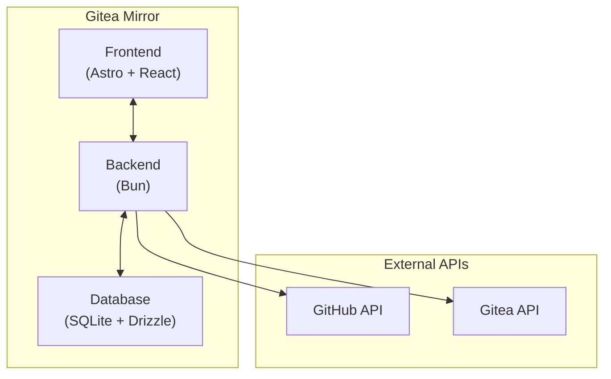

<div class="mb-6">
  <h1 class="text-2xl font-bold text-foreground">Gitea Mirror Architecture</h1>
  <p class="text-muted-foreground mt-2">This document provides a comprehensive overview of the Gitea Mirror application architecture, including component diagrams, project structure, and detailed explanations of each part of the system.</p>
</div>

## System Overview

<div class="mb-4">
  <p class="text-muted-foreground">Gitea Mirror is a web application that automates the mirroring of GitHub repositories to Gitea instances. It provides a user-friendly interface for configuring, monitoring, and managing mirroring operations without requiring users to edit configuration files or run Docker commands.</p>
</div>

The application is built using:

- <span class="font-semibold text-foreground">Astro</span>: Web framework for the frontend
- <span class="font-semibold text-foreground">React</span>: Component library for interactive UI elements
- <span class="font-semibold text-foreground">Shadcn UI</span>: UI component library built on Tailwind CSS
- <span class="font-semibold text-foreground">SQLite</span>: Database for storing configuration, state, and events
- <span class="font-semibold text-foreground">Bun</span>: Runtime environment for the backend
- <span class="font-semibold text-foreground">Drizzle ORM</span>: Type-safe ORM for database interactions

## Architecture Diagram



## Component Breakdown

### Frontend (Astro + React)

The frontend is built with Astro, a modern web framework that allows for server-side rendering and partial hydration. React components are used for interactive elements, providing a responsive and dynamic user interface.

Key frontend components:

- **Dashboard**: Overview of mirroring status and recent activity
- **Repository Management**: Interface for managing repositories to mirror
- **Organization Management**: Interface for managing GitHub organizations
- **Configuration**: Settings for GitHub and Gitea connections
- **Activity Log**: Detailed log of mirroring operations

### Backend (Bun)

The backend is built with Bun and provides API endpoints for the frontend to interact with. It handles:

- Authentication and user management
- GitHub API integration
- Gitea API integration
- Mirroring operations
- Database interactions

### Database (SQLite + Drizzle ORM)

SQLite with Bun's native SQLite driver is used for data persistence, with Drizzle ORM providing type-safe database interactions. The database stores:

- User accounts and authentication data
- GitHub and Gitea configuration
- Repository and organization information
- Mirroring job history and status
- Event notifications and their read status

## Data Flow

1. **User Authentication**: Users authenticate through the frontend, which communicates with the backend to validate credentials.
2. **Configuration**: Users configure GitHub and Gitea settings through the UI, which are stored in the SQLite database.
3. **Repository Discovery**: The backend queries the GitHub API to discover repositories based on user configuration.
4. **Mirroring Process**: When triggered, the backend fetches repository data from GitHub and pushes it to Gitea.
5. **Status Tracking**: All operations are logged in the database and displayed in the Activity Log.

## Project Structure

```
gitea-mirror/
├── src/                  # Source code
│   ├── components/       # React components
│   ├── content/          # Documentation and content
│   ├── layouts/          # Astro layout components
│   ├── lib/              # Utility functions and database
│   ├── pages/            # Astro pages and API routes
│   └── styles/           # CSS and Tailwind styles
├── public/               # Static assets
├── data/                 # Database and persistent data
├── docker/               # Docker configuration
└── scripts/              # Utility scripts for deployment and maintenance
    ├── gitea-mirror-lxc-proxmox.sh  # Proxmox LXC deployment script
    ├── gitea-mirror-lxc-local.sh    # Local LXC deployment script
    └── manage-db.ts                 # Database management tool
```

## Deployment Options

Gitea Mirror supports multiple deployment options:

1. **Docker**: Run as a containerized application using Docker and docker-compose
2. **LXC Containers**: Deploy in Linux Containers (LXC) on Proxmox VE or local workstations
3. **Native**: Run directly on the host system using Bun runtime

Each deployment method has its own advantages:

- **Docker**: Isolation, easy updates, consistent environment
- **LXC**: Lightweight virtualization, better performance than Docker, system-level isolation
- **Native**: Best performance, direct access to system resources
